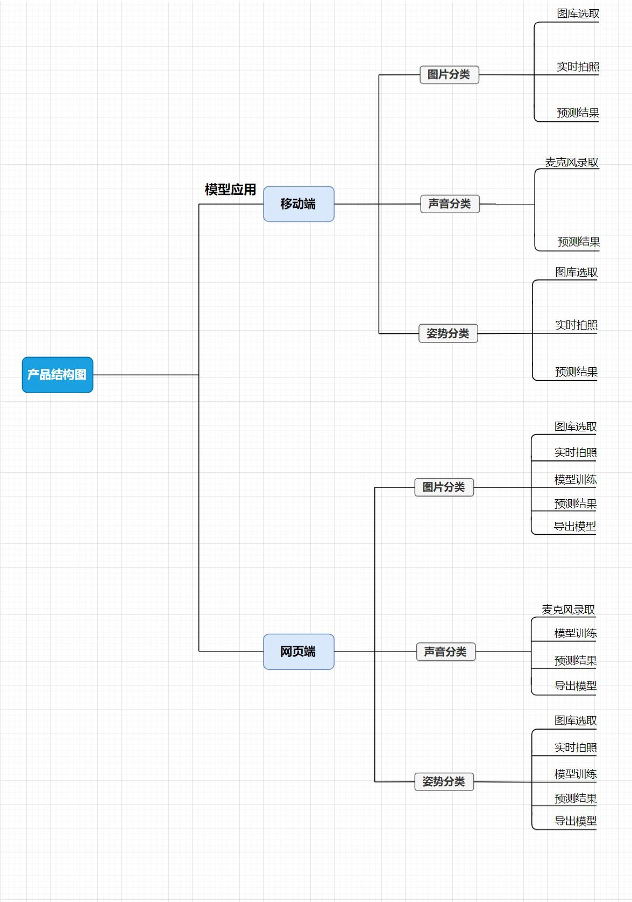
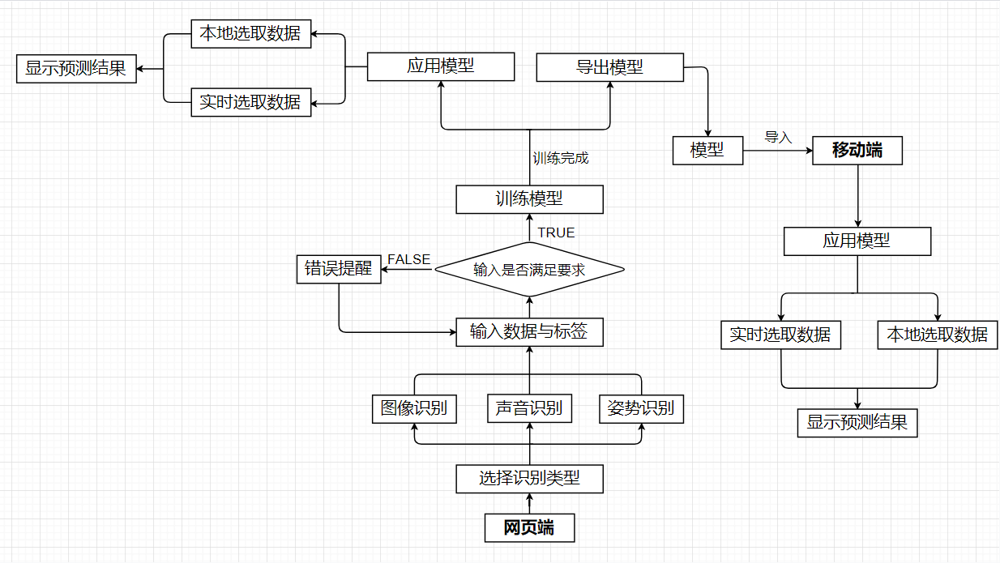
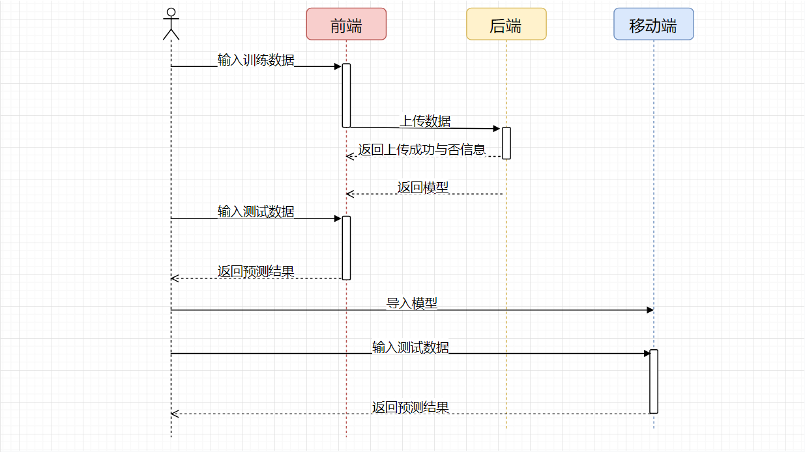

### 1、版本信息

版本号 |修订日期|修订内容
---|---|---
v1.0 |2020.xx.xx|

### 2、文档说明
#### 2.1 文档简介
本文档主要描述 TeachableMachine2.0 的功能需求点及其设计，目的在于清晰地定义各个模块的需求细节以及逻辑流程。

#### 2.2 文档读者
本文档主要面向以下读者：本项目的研发人员、测试人员、产品经理、市场运营人员、管理人员等。

### 3、产品简介
#### 3.1 产品定位
TeachableMachine2.0 是一款零编程基础用户也可以顺畅地教机器进行学习的应用。

TeachableMachine2.0 界面简单易懂，能够较好地满足简易操作需求，让更多的人能够制作自己的机器学习模型。

TeachableMachine2.0 致力于成为用户轻松训练电脑识别图像、声音和人体姿势的得力助手，希望为用户提供便携、高效的使用体验。

#### 3.2 产品特色
TeachableMachine2.0 的使用十分灵活-您可以使用文件或实时捕获示例。这是对您工作方式的尊重，您可以选择完全在设备上使用它，而不需要任何网络摄像头或麦克风数据。

TeachableMachine2.0 可以教模型使用文件或网络摄像头对图像进行分类，教一个模型通过记录短的声音样本来分类音频，教一个模型使用你的网络摄像头中的文件或引人注目的姿势来分类身体位置。

TeachableMachine2.0 通过收集并分类样本来训练模型，接下来可以为项目导出模型到网站、应用程序等上面。你可以免费下载你的模型或在线管理。

TeachableMachine2.0 分为移动端和网页端，网页端可以训练模型，移动端的模型由网页端导入。

TeachableMachine2.0 适合广大用户，编程零基础，使用不需要必备的机器学习知识，可以通过简单方式训练机器学习。

#### 3.3 用户分析
TeachableMachine2.0 面向广大教育家、艺术家、学生、创新者、各种各样的创造者——任何有探索机器学习想法但编程零基础，没有必备的机器学习知识的用户。

### 4、产品架构
#### 4.1 产品结构图

#### 4.2 总体流程图

### 5、详细功能说明
#### 5.1 功能列表
##### 5.1.1 网页端

|序号 | 模块 | 功能 |输入\前置条件|需求说明|输出\后置条件|
| :---:| :------: | :------: |:----:|:------:|:-----:|
| 1 | 图片分类 | 1.教模型使用文件对图像进行分类 2.教模型使用网络摄像头对图像进行分类 | 主页面-图库选取-训练模型或主页面-实时拍照-训练模型| 选择识别类型为图像识别后，根据用户的输入数据与标签，查看是否满足要求，满足即可开始训练模型 | 应用模型或导出模型 |
| 2 | 声音分类 | 1.教模型使用麦克风录取短音频对声音进行分类  | 主页面-麦克风录取-训练模型 |选择识别类型为声音识别后，根据用户的输入数据与标签，查看是否满足要求，满足即可开始训练模型 | 应用模型或导出模型 |
| 2 | 姿势分类 | 1.教模型使用文件中的姿势进行人身位置分类 2.教模型使用网络摄像头中的姿势对人身位置进行分类  | 主页面-图库选取-训练模型或主页面-实时拍照-训练模型 |选择识别类型为姿势识别后，根据用户的输入数据与标签，查看是否满足要求，满足即可开始训练模型 | 应用模型或导出模型 |

##### 5.1.2 移动端

|序号 | 模块 | 功能 |输入\前置条件|需求说明|输出\后置条件|
| :---:| :------: | :------: |:----:|:------:|:-----:|
| 1 | 图片分类 | 1.用已有模型对文件中的图像进行分类 2.用已有模型对网络摄像头中的图像进行分类 | 主页面-图库选取-识别或主页面-实时拍照-识别| 选择识别类型为图像识别后，根据用户的输入数据，显示预测结果 | 预测结果 |
| 2 | 声音分类 | 1.用已有模型对麦克风录取短音频中的声音进行分类  | 主页面-麦克风录取-识别 | 选择识别类型为声音识别后，根据用户的输入数据显示预测结果 | 预测结果 |
| 2 | 姿势分类 | 1.用已有模型对文件中的姿势进行人身位置分类 2.用已有模型模型对网络摄像头中的姿势进行人身位置分类  | 主页面-图库选取-识别或主页面-实时拍照-识别 |选择识别类型为姿势识别后，根据用户的输入数据，显示预测结果 | 预测结果 |

#### 5.2 原型界面

https://free.modao.cc/app/hcJjiNEblxIeY0b5e95TYQoFGGhFWXr?simulator_type=device 

#### 5.3 用例流程

### 6、非功能性需求
#### 6.1 性能需求
1、前端内容展现应保证用户在WIFI及移动网络下使用体验流畅；2、多个用户同时在线时后台信息处理稳定且快速; 3.系统必须在不超过 10 秒的响应时间内,处理 20 起模型训练任务。模型训练的时间要尽可能快，不超过5min以及平均时间在3min以内；4.API请求的平均响应时间应低于1s, WEB首页打开速度5s以下，web登陆速度15s以下。

#### 6.2 运营需求
为了挽留老客户，带给其流畅体验，我们的识别功能有图像识别、声音识别、姿势识别三大类，每次创建自己的模型时，操作简单，适宜完全未接触过编程或机器学习基础知识的人群，模型创建时可以分两类，并且训练模型时间短暂，同时拥有网页端和移动端。

为了吸引新客户，移动端的使用会更加便捷，为了配合手机的算力，可以将模型从网页端直接导入到手机中，移动端更加小巧便于携带，使用摄像头和麦克风十分方便。

### 7、项目规划
1.预计六周后完成V1版本；
2.预计第七周进行改进，完成V2版本
产品预估风险：可能出现用户的音频图像的信息泄露；当千万人级同时在线时，后台处理可能崩溃。 

